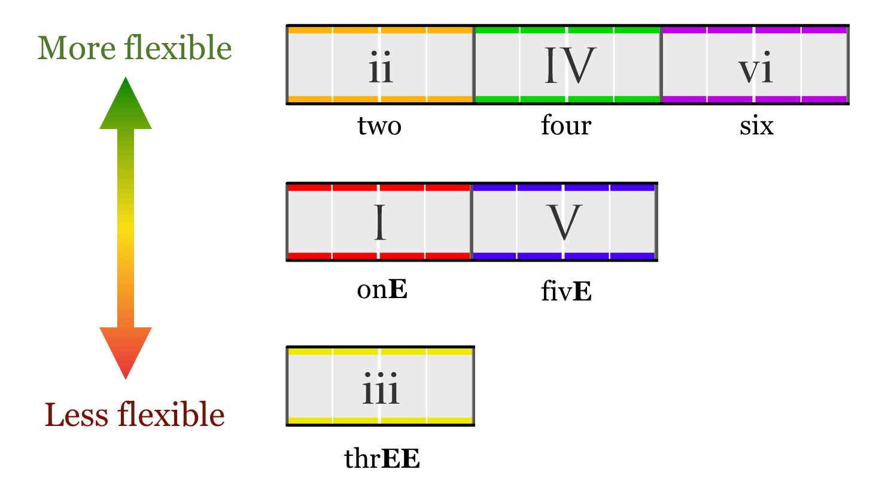
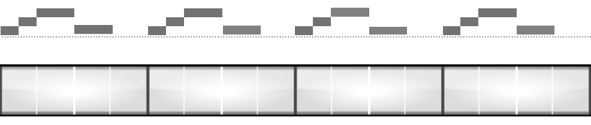
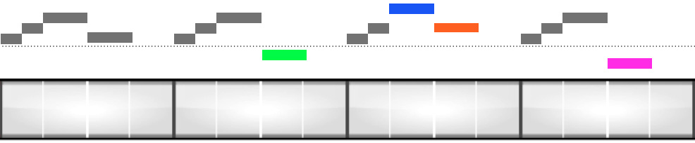
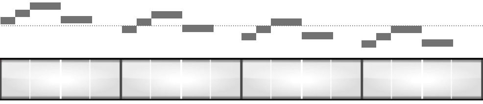

# Chord Popularity

# Chord _I_

* Home base
* Most progressions start with _I_

# Chord _I_6

* Can be used in place of _I_ mid progression
* Doesn't have that home-base feel
* Used to between _ii_ and _IV_

# Chord _ii_

* Sounds further away from home base
* Very flexible on position relative to other chords
* Can be used as a substitue for _IV_ (not for **candence**)
* Sounds good before or after _IV_
* **Pre-Candence** chord.

# Chord _iii_

* Sounds further away from home base
* Can be followed by _IV_ and _vi_
* Often comes after _I_ in short progressions
* Used in-between _vi_ and _IV_

# Chord _IV_

* Second strongest **candence**
* **Pre-Candence** chord.

# Chord _V_

* Strongest **candence**

# Chord _V_6

* Tendency to go back to _I_ decreased
* Often used after _I_
* Can be used between _I_ and _vi_

# Chord _vi_

* Can be used after _I_
* Can be used before or after _IV_ & _V_
* Common Usage: _I_ - _V_ - _vi_ - _IV_

# Chord _vii_

* Not used often at all

# Melody Chord Flexibility

# Melody Repetition

# Melody Repetition

# Sequence

